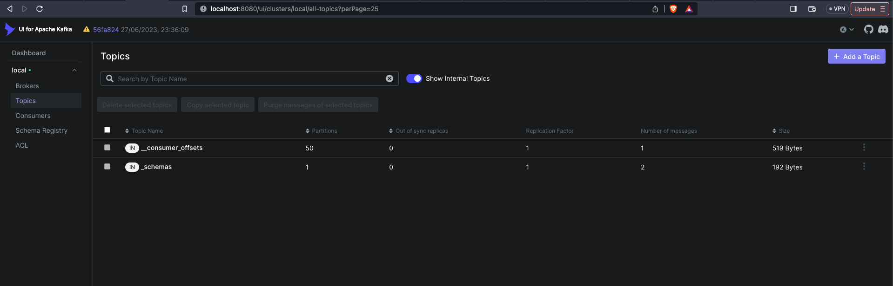
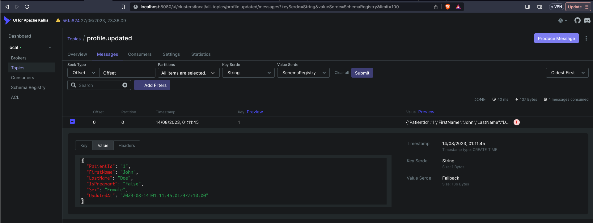

### Background

The microservices are composed of two services: the Profile service and the Consultation service. The Profile service manages the patient's medical and demographic information, while the Consultation service manages GP appointment information and other information related to appointment management. Apache Kafka is used for event streaming. The `Patient Profile Updated` event is used for streaming patient profile updating events from the Profile service to the Consultation service.

In other words, the Profile service stores information about the original data of the patient profile entity, while the Consultation service stores the replicated data. The data is synchronized using Kafka event streaming. The Profile service is the event producer, while the Consultation service is the event consumer.

### Problem

For unknown reasons, two "Patient Profile Updated" events associated with the same patient are triggered almost simultaneously. For example:

```
Event1: {
patientID: 1,
firstName: “John”,
lastName: ”Doe”,
isPregnant: false,
updatedAt: “2006-01-02T15:00:00.000000000Z10:00”
}

Event2: {
patientID: 1,
firstName: “John”,
lastName: ”Doe”,
isPregnant: true,
updatedAt: “2006-01-02T15:00:00.500000000Z10:00”
}
```

Assuming these two events are produced in sequence (with Event1 produced before Event2), but there is no guarantee that the events will be consumed in sequence on the consumer side (event 1 will be received after event2). As a result, in some edge cases, patient "John" might be saved as `isPregnant: false` on the consumer side.

### Solution

Kafka guarantees the order of the events within the same topic partition. However, by default, it does not guarantee the order of events across all partitions. 

In order to guarantee ordered message delivery with the Kafka messaging broker, messages can be produced with a key called `Message Key`. Messages with the same key are written to the same topic partition, and as consumers read messages in order from each partition, their ordering is preserved'

#### Message Keys

In order to guarantee message ordering, related messages that should be ordered must be written to the same topic partition. This is achieved by writing the message with a header key. There is a less common alternative to using a message key which is for the producer itself to stipulate which partition to write a message to.

As with the message body, the key can be typed as required, such as a String, Integer or a JSON object. Likewise, as with the body, the key can have an Avro schema defined. The key is hashed by the producer, and this hash is used to determine which partition to write the message to. If no message with this hashed key has yet been written to a partition, (or indeed no key has been included) then a new partition will be selected, with Kafka typically attempting to spread load evenly across the partitions.

### Patient Profile

`/patientprofile` is an endpoint which publishes event called `patient.profile.updated` on kafka and it has a consumer which consumes the kafka event `patient.profile.updated` and thereby persist the data in the database.

### Code Design and structure

Go programs are organized into packages. A package is a collection of source files in the same directory that are compiled together. Functions, types, variables, and constants defined in one source file are visible to all other source files within the same package.
This repository contains a single module, located at the root of the repository. A file named go.mod there declares the module path: the import path prefix for all packages within the module. The module contains the packages in the directory containing its go.mod file as well as subdirectories of that directory, up to the next subdirectory containing another go.mod file (if any).
Common terms we use in package structure 
1. **/cmd**

   - This folder contains the main application entry point files for this project. It contains two folders /producer and /consumer and their respective main.go to start producer and consumer respectively where as producer is an api to publish events to kafka and consumer is to consume the corresponding event and persist in database
2. **/devstack**

   - This folder contains a script to run the database locally. For ease of running it locally, easier to connect to `localstack` that mimics DynamoDB as opposed to connecting to DynamoDB every time
3. **/internal**

    - This package holds the private library code used in your service, it is specific to the function of the service and not shared with other services. This is the place wherein components are organized by kind.
4. **/api**

    - This is exposing an api where events are processed and published to kafka. It contains handler.go which calls service.go which actually connects to kafka and publishes the event. It also contains types.go which contains all types and interfaces
5. **/config**

    - This contains config file which contains all environment variable configuration
6. **/consumer**

    - As the name suggests, it contains the consumer to consume events from kafka. The file handler.go consumes events from kafka, it also contains types.go which contains all types and interfaces
7. **/store**
   
   - This is the place where we persist data in the database. Writer.go persists data in the database. Also, types.go which contains all types and interfaces
8. **Makefile**
9. **localstack-compose.yml**
   
    - This is a docker compose file which spins up kafka and local database(localstack)

### Design Patterns Used

1. **Single Responsibility Principle (SRP)**
The essence of the Single Responsibility Principle lies in the limitation of responsibilities of an entity (class, function, package, or module). It should concentrate on a single task and encapsulate all the elements necessary for executing the specified task.
   - Each function should be responsible for a single piece of functionality, and it should do it well.
   - Each package should have a clear, well-defined purpose. E.g in my project all packages have well defined purpose i.e consumer is meant to consume messages from kafka and store purpose is to persist in database etc..
     Makefile makes compiling and running the application easier in a way that any engineer
     does not need to remember how to run and application irrespective of any coding
     language used.
     Makefile makes compiling and running the application easier in a way that any engineer
     does not need to remember how to run and application irrespective of any coding
     language used.
     SRP Helps with
   - Increasing readability: When a component has a single responsibility, it is easier to name and, consequently, easier to understand and read.
   - To keep code modular, testable, and easy to understand and maintain.
2. **Dependency Inversion Principle (DIP)**
     This principle states that high-level modules should not depend on low-level modules, but rather both should depend on abstractions. This helps to reduce the coupling between components and make the code more flexible and maintainable.
     E.g in my code
     The consumer struct 
```
type Consumer struct {
     topicName string
     writeStore store.StoreWriter 
     consumerClient ConsumerClient
     }
```

The consumer struct depends on StoreWriter and ConsumerClient interface rather than specific implementation like store struct consumerClient struct. This makes the code more flexible and easier to maintain, as changes to the implementation of store and consumerClient will not affect the Consumer struct.    

### Advantages of Localstack

LocalStack provides an easy-to-use test/mocking framework for developing Cloud applications. It spins up a testing environment on your local machine that provides the same functionality and APIs as the real AWS cloud environment.

This is exactly what we needed.
As simple as that, LocalStack starts a real AWS cloud environment on your laptop. It currently supports around 30 popular AWS services and counting.

##### Impact

Can run the entire cloud infrastructure locally and can experiment, test functionality and do whatever they want in full isolation.
We no longer spend time debugging race conditions or trying to figure out who deleted an item or resource, or what IAM permissions a certain service or resource needs in order to access another resource.
Our cloud costs have dropped significantly, and the load on our DevOps engineer has decreased dramatically.

## Steps to execute

## Run Locally

Boot up kafka UI and DB locally

```shell
make local-dev-stack
```

Open 

```
http://localhost:8080/
```

Looks like 



### Steps to execute the app

```shell
make mod-tidy
```


```shell
make mod-dl
```
### Tests
The below make command will run all the unit tests

```shell
make test
```

One one terminal run below

``` shell
make run-producer

```

One other terminal run below

``` shell
make run-consumer

```

Run the following command

```shell
curl --location --request POST '0.0.0.0:3000/patientprofile' \
--header 'Content-Type: application/json' \
--data-raw '{ "PatientId": "1", "FirstName": "John", "LastName": "Doe", "IsPregnant": "False", "Sex": "Female"}' 
```

To check if its inserted in DB properly, run the following command

```shell
aws dynamodb scan --endpoint-url=http://localhost:4566 \      
   --table-name patient-profile
```

The result will be as follows

```shell

{
    "Items": [
        {
            "LastName": {
                "S": "Doe"
            },
            "IsPregnant": {
                "S": "False"
            },
            "UpdatedAt": {
                "S": "2023-08-14T01:11:45.105211+10:00"
            },
            "FirstName": {
                "S": "John"
            },
            "Sex": {
                "S": "Female"
            },
            "PatientId": {
                "S": "1"
            }
        }
    ],
    "Count": 1,
    "ScannedCount": 1,
    "ConsumedCapacity": null
}

```

Kafka will look like this 



``
brew install mockery
``